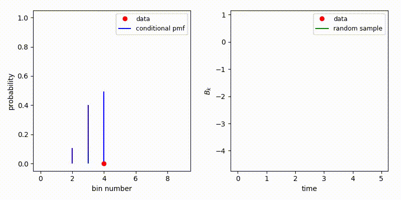
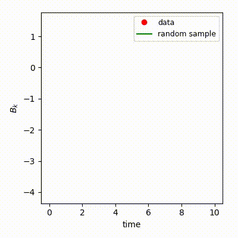

# Tutorial: Quantized Softmax Network for the Lorenz 96 system

The two layer Lorenz 96 (L96) system is given by:


It can be considered as a simplified atmospheric model on a circle of constant latitude. The `X_k` variables are the large-scale components of the system, whereas the `Y_{k,j}` are the small-scale counterparts. Each spatial location indexed by `k=1,...,K` has `J` small-scale components `Y_{k,j}`, with `j=1,...,J`. Thus the system consists of `JK` coupled ordinary differential equations (ODEs). In this tutorial we will use `K=18` and `J=20` such that we have 360 couples ODEs. Finally, the `B_k` term is the subgrid-scale (SGS) term, through which the small-scale information enters the large-scale `X_k` ODEs. If we are able to create a surrogate for `B_k`, conditional on large-scale variables only, the dimension of the system drops from 360 down to 18. Here, we will create a surrogate model in the form of a quantized softmax network (QSN), which is stochastic in nature. 

Our general aim is to create a surrogate such that the long-term statistics of the large-scale system match those generated from validation data. Thus we do not expect accuracy from the large-scale `X_k` system forced by the QSN surrogate at any given point in time.

The details of the QSN approach can be found in [this](https://arxiv.org/abs/2004.01457) preprint.

## Files

The `tests/lorenz96_qsn` folder constains all required scripts to execute this tutorial: 

+ `tests/lorenz96_qsn/lorenz96.py`: the unmodified solver for the Lorenz 96 system, used to generate the training data.
+ `tests/lorenz96_qsn/train_surrogate.py`: script to train a QSN surrogate on L96 data.
+ `tests/lorenz96_qsn/lorenz96_qsn.py`: this is the L96 solver again, where the call to the small-scale system is replaced by a call to the QSN surrogate.
+ `lorenz96_analysis.py`: the post-processing of the results of `lorenz96_qsn.py`.

Execute these script in the specified order to run the tutorial. Details are given below.

## Generate training data

The first step is to generate the training data, by executing `python3 tests/lorenz96_qsn/lorenz96.py`. This will generate training pairs that are used in `tests/lorenz96_qsn/train_surrogate.py`. You will be asked for a location to store the data (HDF5 format).

## Train the Quantized Softmax Network

As explained in the general EasySurrogate tutorial (`tutorials/General`), we begin by creating a EasySurrogate campaign, and loading the training data:

```python
# create EasySurrogate campaign
campaign = es.Campaign()

# load HDF5 data frame
data_frame = campaign.load_hdf5_data()

# supervised training data set
features = data_frame['X_data']
target = data_frame['B_data']
```

Here our large-scale features will the the `K` time series of the `X_k` variables, and our target data are the `K` times series of the subgrid-scale term `B_k`. The next step is to create a QSN surrogate object via:

```
# create Quantized Softmax Network surrogate
surrogate = es.methods.QSN_Surrogate()
```

At this point the specifics of a QSN surrogate come into play. One of our aims is to create a surrogate with 'memory', i.e. a surrogate that is non-Markovian. At the heart of our QSN surrogate is a feed-forward neural network. To add a memory dependence here, we create time-lagged feature vectors. Another means of doing so would be to use a recurrent neural network, which is an option planned for future releases. Say we wish to train a QSN surrogate using time-lagged input fearures at 1 and 10 time steps into the past. This is done via:

```
# create time-lagged features
lags = [[1, 10]]

# train the surrogate on the data
n_iter = 2000
surrogate.train([features], target, lags, n_iter, n_layers=4, n_neurons=256,
                batch_size=50)
```

```
campaign.add_app(name='test_campaign', surrogate=surrogate)
campaign.save_state()

# QSN analysis object
analysis = es.analysis.QSN_analysis(surrogate)
analysis.get_classification_error(features[0:1000], target[0:1000])
```



## Prediction with a QSN surrogate



Pre-generated statistical results van be found in `tests/figures`, e.g. the probability density function of X_k computed from the full two-layer L96 system and the one-layer model forced by the QSN SGS model:

## Analysis


