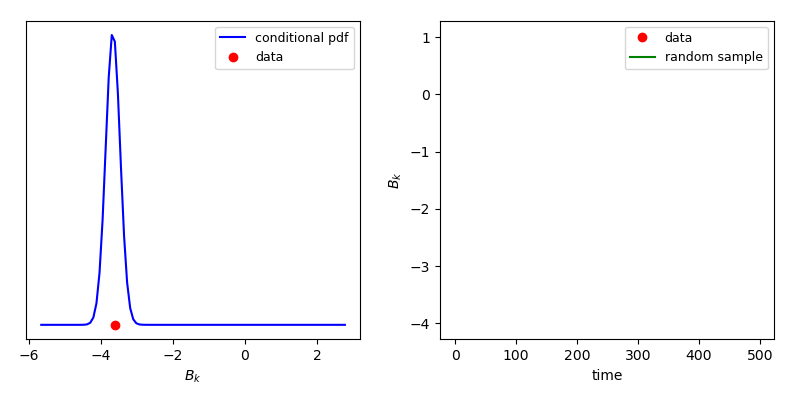
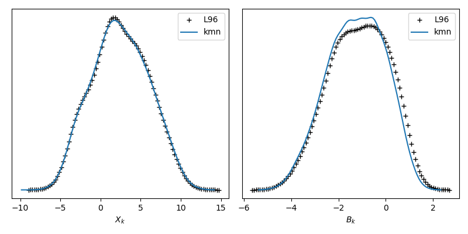

# Tutorial: Kernel Mixture Network for the Lorenz 96 system

The two layer Lorenz 96 (L96) system is given by:


It can be considered as a simplified atmospheric model on a circle of constant latitude. The `X_k` variables are the large-scale components of the system, whereas the `Y_{k,j}` are the small-scale counterparts. Each spatial location indexed by `k=1,...,K` has `J` small-scale components `Y_{k,j}`, with `j=1,...,J`. Thus the system consists of `JK` coupled ordinary differential equations (ODEs). In this tutorial we will use `K=18` and `J=20` such that we have 360 coupled ODEs. Finally, the `B_k` term is the subgrid-scale (SGS) term, through which the small-scale information enters the large-scale `X_k` ODEs. If we are able to create a surrogate for `B_k`, conditional on large-scale variables only, the dimension of the system drops from 360 down to 18. Here, we will create a surrogate model in the form of a kernel mixture network (KMN), which is stochastic in nature. 

Our general aim is to create a surrogate such that the long-term statistics of the large-scale system match those generated from validation data. Thus we do not expect accuracy from the large-scale `X_k` system forced by the KMN surrogate at any given point in time.

The details of the KMN approach can be found in [this](https://www.researchgate.net/publication/317040575_The_Kernel_Mixture_Network_A_Nonparametric_Method_for_Conditional_Density_Estimation_of_Continuous_Random_Variables) article.

## Files

The `tests/lorenz96_kmn` folder constains all required scripts to execute this tutorial: 

+ `tests/lorenz96_kmn/lorenz96.py`: the unmodified solver for the Lorenz 96 system, used to generate the training data.
+ `tests/lorenz96_kmn/train_surrogate.py`: script to train a KMN surrogate on L96 data.
+ `tests/lorenz96_kmn/lorenz96_kmn.py`: this is the L96 solver again, where the call to the small-scale system is replaced by a call to the KMN surrogate.
+ `tests/lorenz96_kmn/lorenz96_analysis.py`: the post-processing of the results of `lorenz96_kmn.py`.

Execute these script in the specified order to run the tutorial. Details are given below.

## Generate training data

The first step is to generate the training data, by executing `python3 tests/lorenz96_kmn/lorenz96.py`. This will generate training pairs that are used in `tests/lorenz96_kmn/train_surrogate.py`. You will be asked for a location to store the data (HDF5 format).

## Train the Kernel Mixture Network

As explained in the general EasySurrogate tutorial (`tutorials/General`), we begin by creating a EasySurrogate campaign, and loading the training data:

```python
# create EasySurrogate campaign
campaign = es.Campaign()

# load HDF5 data frame
data_frame = campaign.load_hdf5_data()

# supervised training data set
features = data_frame['X_data']
target = data_frame['B_data']
```

Here, our large-scale features will the the `K` time series of the `X_k` variables, and our target data are the `K` times series of the subgrid-scale term `B_k`. The next step is to create a KMN surrogate object via:

```
# create Kernel Mixture Network surrogate
surrogate = es.methods.KMN_Surrogate()
```

At this point the specifics of a KMN surrogate come into play. At the heart of our KMN surrogate is a feed-forward neural network, which predicts the weights of a kernel-density estimate (KDE). We can write KDE for a probability density function `p(B_k | X_k)` as follows:


Here, `K` are the Kernels (we use Gaussian kernels), each of which has its own mean (indexed by `i`) and standard deviation (indexed by `j`). The weights `w_{i,j}` are predicted by the neural network, and must sum to one. To ensure the latter, we use a softmax layer at the output. 

Note that each `w_{i,j}` is associated with one mean `mu_i` and one standard deviation `sigma_j`. Also note from the equation above that they are functions of `X_k`. The general idea is that, conditional on the macroscopic `X_k` variables at the input, most weights will be (close to) zero. Only a small subset of `w_{i,j}` should activate, leading to an informed pdf over a small `B_k` region. We then randomly sample this pdf to obtain a stochastic `B_k` prediction.

For each of the 18 spatial points, we specify 15 means (or "anchor points") that span the range of `B_k` data at that location, in addition to 3 values for the standard deviation:
```
# create the KDE anchor points and standard deviations
n_means = 15; n_stds = 3
kernel_means = []; kernel_stds = []

n_out = target.shape[1]
for i in range(n_out):
    kernel_means.append(np.linspace(np.min(target[:, i]), np.max(target[:, i]), n_means))
    kernel_stds.append(np.linspace(0.2, 0.3, n_stds))
```
The list of these kernel properties will be passed to the `train` subroutine, see below. Note that the KMN surrogate will make all possible combinations of the specified means and standard deviations. Thus, each of the 18 spatial points will have its own softmax layer, consisting of `15*3=45` inputs. The total number of output neurons is therefore `18*45=810`.

Besides stochasticity, another one of our aims is to create a surrogate with 'memory', i.e. a surrogate that is non-Markovian. For instance,


is a pdf for the value of `B_k` at the next time step, conditioned on two time-lagged values of `X_k`. To add a memory dependence here, we therefore create time-lagged feature vectors. Another means of doing so would be to use a recurrent neural network, which is an option planned for future releases. Say we wish to train a KMN surrogate using time-lagged input features at 1 and 10 time steps into the past. This is done via:

```python
# create time-lagged features
lags = [[1, 10]]

# train the surrogate on the data
n_iter = 10000
surrogate.train([features], target, lags, n_iter,
                kernel_means, kernel_stds,
                n_layers=4, n_neurons=256,
                test_frac = 0.5, batch_size=512)

campaign.add_app(name='test_campaign', surrogate=surrogate)
campaign.save_state()
```

The `train` method should be supplied with a list of (different) input features, and an array of target data points, in this case an array of `nx18` subgrid-scale data points. Here, `n` is the number of training points. If `test_frac > 0` as above, the specified fraction of the data is withheld as a test set, lowering the value of `n`. Various aspects of the feed-forward neural network are defined here as well, such as the number of layers, the number of neurons per layers, the type of activation function and the minibatch size used in stochastic gradient descent. Other activation options are `tanh`, `hard_tan` and `relu`. After training, the surrogate is added to the campaign and saved to disk.

To get a qualitative idea of the off-line performance of a KMN surrogate, a movie can be generated where the KMN surrogate is evaluated off-line on the training dataset:

```python
# KMN analysis object
analysis = es.analysis.KMN_analysis(campaign.surrogate)
analysis.make_movie()
```



Left shows the KMN prediction for a single spatial location, alongside the training data point. Right show the corresponding `B_k` time series, for both the stochastic KMN surrogate and the actual time evolution of the training data. It is recommended to have `ffmpeg` installed if `make_movie` is used.

## Prediction with a KMN surrogate

Prediction occurs in exactly the same fashion as with the quantized softmax surrogate (QSN) and the vanilla artificial neural network (ANN). In fact, `tests/lorenz96_kmn/lorenz96_kmn.py` is unmodified compared to `tests/lorenz96_qsn/lorenz96_qsn.py` and `tests/lorenz96_ann/lorenz96_ann.py`.

Hence, to predict with a KMN surrogate, the original L96 code must be modified in 2 places, namely in the initial condition (IC) and the call to the micro model. Changing the IC is required due to the time-lagged nature. We use the data at the maximum lag specified as IC, such that we can build a time-lagged vector (also from the data) at the first time step. In `tests/lorenz96_kmn/lorenz96_kmn.py` we find:

```python
##############################
# Easysurrogate modification #
##############################

# load pre-trained campaign
campaign = es.Campaign(load_state=True)

# change IC
data_frame = campaign.load_hdf5_data()
X_n = data_frame['X_data'][campaign.surrogate.max_lag]
B_n = data_frame['B_data'][campaign.surrogate.max_lag]
# initial right-hand side
f_nm1 = rhs_X(X_n, B_n)

##################################
# End Easysurrogate modification #
##################################
```
Here, `campaign = es.Campaign(load_state=True)` loads the pre-trained KMN surrogate from `tests/lorenz96_kmn/train_surrogate.py`, and we use the HDF5 training data from 
`tests/lorenz96_kmn/lorenz96.py` to select the `X_k` and `B_k` snapshots at the timestep corresponding to the maximum lag that was specified. Upon finishing the training step, the corresponding first time-lagged feature vector is automatically stored in the surrogate.

The second modification involves replacing the call to the surrogate with a call to `surrogate.predict`:

```python
##############################
# Easysurrogate modification #
##############################

# Turn off call to small-scale model
# solve small-scale equation
# Y_np1, g_n, multistep_n = step_Y(Y_n, g_nm1, X_n)
# compute SGS term
# B_n = h_x*np.mean(Y_n, axis=0)

# replace SGS call with call to surrogate
B_n = campaign.surrogate.predict(X_n)

##################################
# End Easysurrogate modification #
##################################
```

Here, `B_n` is the current state of the subgrid-scale term, and `X_n` is the state of the large-scale variables. The subroutine `predict(X_n)` updates the time-lagged input features and returns a stochastic prediction for `B_n` as described above. The rest of the code is unmodified.

## Analysis

One of the statistics we might be interested are the probability density functions (pdfs) of `X_k` and `B_k`, for both the full (validation) data set and the data set obtained in the 'online' phase from the preceding step. This is done via a `KMN_Analysis` object:

```python
# load the campaign
campaign = es.Campaign(load_state=True)
# load the training data (from lorenz96.py)
data_frame_ref = campaign.load_hdf5_data()
# load the data from lorenz96_kmn.py here
data_frame_kmn = campaign.load_hdf5_data()

# load reference data
X_ref = data_frame_ref['X_data']
B_ref = data_frame_ref['B_data']

# load data of kmn surrogate
X_kmn = data_frame_kmn['X_data']
B_kmn = data_frame_kmn['B_data']

# create kmn analysis object
analysis = es.analysis.KMN_analysis(campaign.surrogate)

#############
# Plot PDFs #
#############

start_idx = 0
fig = plt.figure(figsize=[8, 4])
ax = fig.add_subplot(121, xlabel=r'$X_k$')
X_dom_surr, X_pde_surr = analysis.get_pdf(X_kmn[start_idx:-1:10].flatten())
X_dom, X_pde = analysis.get_pdf(X_ref[start_idx:-1:10].flatten())
ax.plot(X_dom, X_pde, 'k+', label='L96')
ax.plot(X_dom_surr, X_pde_surr, label='kmn')
plt.yticks([])
plt.legend(loc=0)

ax = fig.add_subplot(122, xlabel=r'$B_k$')
B_dom_surr, B_pde_surr = analysis.get_pdf(B_kmn[start_idx:-1:10].flatten())
B_dom, B_pde = analysis.get_pdf(B_ref[start_idx:-1:10].flatten())
ax.plot(B_dom, B_pde, 'k+', label='L96')
ax.plot(B_dom_surr, B_pde_surr, label='kmn')
plt.yticks([])
plt.legend(loc=0)

plt.tight_layout()
```

Pre-generated statistical results are shown below:



In `tests/lorenz96_kmn/lorenz96_analysis.py` other statistical quantities are also computed.
