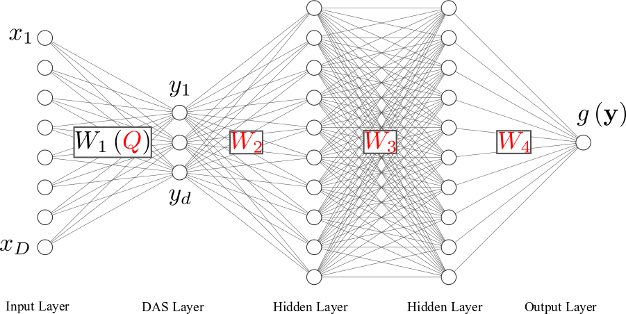
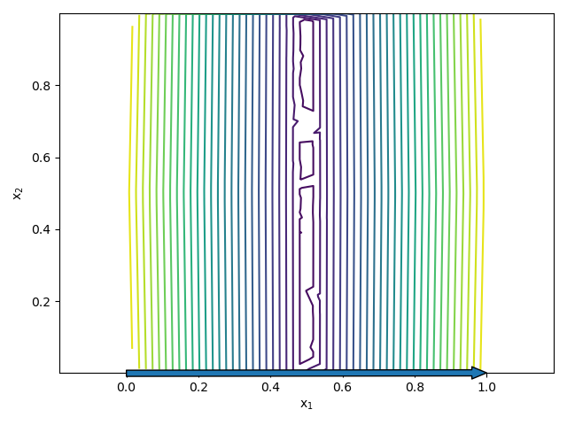
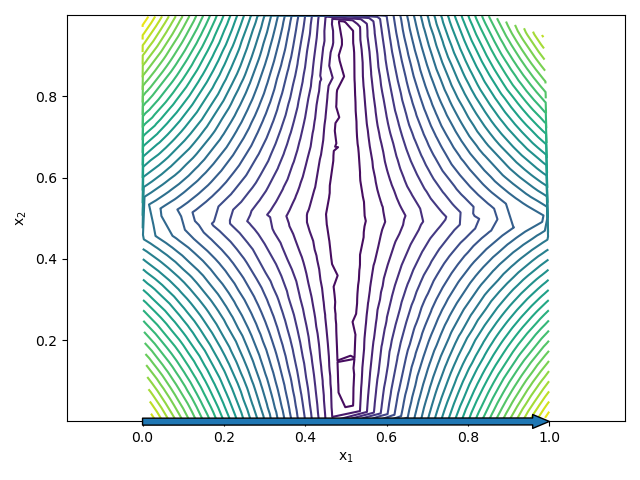
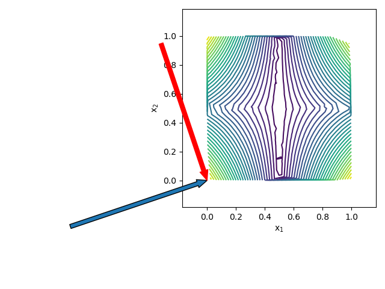
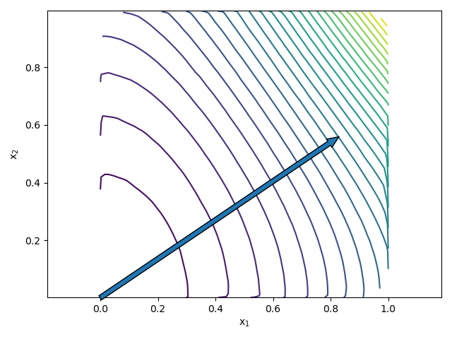
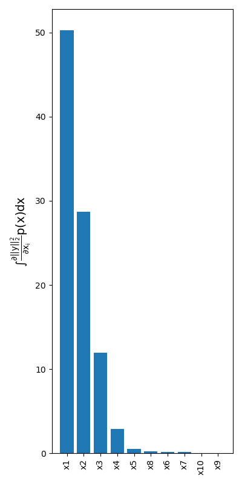

# Tutorial: Training using a data frame generated by EasyVVUQ

In this tutorial we will create a forward uncertainty-propagation surrogate using a Deep Active Subspace network, trained on a data frame generated by [EasyVVUQ](https://github.com/UCL-CCS/EasyVVUQ). Forward uncertainty propagation is defined as computing the output distribution of a computational model, given *assumed* probability density functions for the input paramaters of the model, see the image below for a sketch of the problem. A related problem is creating a cheap surrogate model for the input-output map, which can be evaluated at a fraction of the cost of the computational model. EasyVVUQ is VECMA's forward uncertainty propagation toolkit. 


## Problem definition

For computational efficiency we will consider the analytical Sobol G function, see [this page](https://www.sfu.ca/~ssurjano/gfunc.html) for a desription of this function. In addition, we consider the following function:


This function we will denote simply as the polynomial function. Both functions have a vector of coefficients `a`. The entries`a_i` determine the importance of each input. Entries are positive and higher values indicates less significant parameters in the case of the G function. For the polynomial function, its values are in `[0, 1]` and in this case a smaller value results in the corresponding input to be less significant.

The following files are relevant:

* `tests/deep_active_subspaces/model/func.py`: the implementation of the polynomial / Sobol G function.
* `tests/deep_active_subspaces/generate_easyvvuq_dataframe.py`: script that generates the training data using EasyVVUQ.
* `tests/deep_active_subspaces/train_DAS_surrogate.py`: script that trains a Deep Active Subspace (DAS) surrogate on the EasyVVUQ data frame.

## Active subspaces

The Active Subspace method, introduced in [1], is a class of methods for forward propagation of uncertainty in high-dimensional input spaces. It attempts to circumvent the curse of dimensionality by
dimension reduction of the input space. Specifically, it projects the input vector x (of size `D`) to a lower-dimensional subspace y of size `d` (`d < D`), via a tall-and-skinny matrix `W_1` of orthogonal basis vectors. The active subspace is thus given by


where the main idea is that the dimension reduction simplifies the task of obtaining an accurate surrogate model. If we denote this surrogate by `g(y)`, and the full code as `f(x)`, we thus want to find a model that satisfies


Because `y` is a linear transformation of the inputs `x`, it opens up the possibility of findings directions along which the model varies most. This is especially useful if a model varies significantly in a direction that is not aligned with the coordinate axes of `x`. In `classical' active subspaces [1], dimension reduction is achieved by rotating the coordinate system such that it is aligned with the directions of most variability, after which only the most dominant directions are retained. To find these directions, the following average gradient matrix is constructed:


Here, `p(x)` is the chosen probability density function (pdf) of the inputs `x`. Since `C` is a symmetric, positive semi-definite matrix, it has the following spectral decomposition


Hence the matrix `W_1`, used to project `x` to `y` are the first `d` eigenvectors of `C`, which in turn correspond to the `d` largest eigenvalues. These `d` eigenvectors form an orthonormal basis aligned with the directions of most variability. Note that `C` is averaged over `p(x)`, and that in practise, the integral in `C` is often approximated using a Monte Carlo approach.

The approach described here is intuitive, and has nice theoretical properties, such as computable error bounds. The downside however, is that the gradient of `f` must be available. This requires the availability of an adjoint solver, or one must approximate the gradients using for instance finite differences. This downside has prompted the development of other active subspace methods which do not require access to the gradient. Some of these methods involve Gaussian processes [2], whereas others use deep learning. We will focus on the latter.

## Deep Active Subspaces

In [3], an approach is described in which artificial neural networks (ANNs) are used for `g`, and where `W_1` is found using back propagation. The column vectors of `W_1` still form an orthogonal basis. The difference is that these column vectors are no longer the eigenvectors of the gradient matrix `C`, but instead are constructed using Gram-Schmidt orthogonalization. As such, `W_1` is parametrized by a matrix `Q` of the same dimension, where the non-orthonormal column vectors `q_i` (size D) are made orthonormal via:


That is, we start with `w_1 = q_1`, and for all subsequent vectors `q_1` we subtract the projections of `q_i` onto each vector `w_j` which has previously been orthogonalized. This leaves us with a orthogonal basis:


Finally, to obtain an orthonormal basis, each column vector is divided by its length. such that our final weight matrix becomes


Note that the projection `y = W_1^Tx` also occurs in a layer of a neural network if the activation function is linear. Thus, we can interpret the matrix `W_1` as a weight matrix of the first hidden layer (with `d` neurons and linear activation), connected to an input layer through which `x` is passed. Each column vector `w_i` contains the all weights connecting the input layer to the i-th neuron of the first hidden layer, see Figure below. Since the first hidden layer has only `d` neurons, and its weight matrix is determined from a Gram-Schmidt procedure, we call the layer the Deep Active Subspace (DAS) layer.


The surrogate `g(y)` is the ANN from the DAS layer onward, see Figure below. Each hidden layer has a weight matrix `W_i`. As per usual, these weight matrices are optimized through the back propagation algorithm, in which the gradient `dL/dW_i` is computed, where `L` is the loss function.



The situation in the DAS layer is different. Since `W_1=W_1(Q)`, we need to optimize `Q` instead of the weight matrix, and therefore back propagation requires `dL/dQ` instead of `dL/dW_1`. The authors of [3] suggest to use automatic differentiation. This does make sense, since although Gram-Schmidt vectors are algebraic and differentiable, it quickly becomes a complicated expression involving a very large number of `q_ij` terms. Here, `q_ij` are the `D` entries of column vector `q_j`. That said, we used matrix calculus to find a simple expression for `dL/dQ`. Details are given in the attached `report_DAS.pdf` file.

This concludes the theoretical background. For more information, we refer to [3].

## EasyVVUQ Latin Hypercube campaign

We will use EasyVVUQ to generate a Latin Hypercube sampling plan of the Sobol G function in `D` dimensions. We will assume you are familiar with EasyVVUQ, and copy the code of `tests/deep_active_subspaces/generate_easyvvuq_dataframe.py` wholesale below:

```python
# the absolute path of this file
HOME = os.path.abspath(os.path.dirname(__file__))

# EasyVUQ work directory
WORK_DIR = '/tmp'

# EasyVVUQ database location
ID = 'func'
DB_LOCATION = "sqlite:///" + WORK_DIR + "/campaign%s.db" % ID

########################
# EasyVVUQ MC Campaign #
########################

# choose a number of uncertain parameters (< 10)
D = 10

# Define parameter space
params = {}
for i in range(10):
    params["x%d" % (i + 1)] = {"type": "float",
                               "min": 0.0,
                               "max": 1.0,
                               "default": 0.5}
params["D"] = {"type": "integer", "default": D}
params["out_file"] = {"type": "string", "default": "output.csv"}
output_filename = params["out_file"]["default"]
output_columns = ["f"]

# the a vector determines the importance of each input
# a = np.linspace(0, np.sqrt(100), 10)**2
a = np.array([1 / 2 ** i for i in range(10)])
# a = np.zeros(10)
# a[0] = 1
# a[1] = 0.5
for i in range(10):
    params["a%d" % (i + 1)] = {"type": "float",
                               "min": 0.0,
                               "max": 100.0,
                               "default": a[i]}

# create encoder, decoder, and execute locally
encoder = uq.encoders.GenericEncoder(template_fname=HOME + '/model/func.template',
                                     delimiter='$',
                                     target_filename='in.json')
decoder = uq.decoders.SimpleCSV(target_filename=output_filename,
                                output_columns=output_columns)
execute = ExecuteLocal('{}/model/func.py in.json'.format(os.getcwd()))
actions = Actions(CreateRunDirectory(root=WORK_DIR),
                  Encode(encoder), execute, Decode(decoder))

# uncertain variables
vary = {}
for i in range(D):
    vary["x%d" % (i + 1)] = cp.Uniform(0, 1)

# Latin Hypercube sampler
my_sampler = uq.sampling.quasirandom.LHCSampler(vary=vary, max_num=1000)

# EasyVVUQ Campaign
campaign = uq.Campaign(name='func', params=params, actions=actions,
                       work_dir=WORK_DIR, db_location=DB_LOCATION)

# Associate the sampler with the campaign
campaign.set_sampler(my_sampler)

# Execute runs
campaign.execute().collate()
```

## Training a DAS surrogate on the EasyVVUQ data frame

The EasyVVUQ data frame can be read into EasySurrogate via:

```python

# reload EasyVVUQ campaign
campaign = uq.Campaign(name=ID, db_location=DB_LOCATION)
print("===========================================")
print("Reloaded campaign {}".format(ID))
print("===========================================")
sampler = campaign.get_active_sampler()
campaign.set_sampler(sampler, update=True)

# Create an EasySurrogate campaign
surr_campaign = es.Campaign()

# This is the main point of this test: extract training data from EasyVVUQ data frame
features, samples = surr_campaign.load_easyvvuq_data(campaign, qoi_cols='f')
```

Here, `DB_LOCATION` is the location of the EasyVVUQ database, which we stored in the work directory of the EasyVVUQ campaign. This will output something like:

```
Extracting features ['x1', 'x2', 'x3', 'x4', 'x5']
Extracting output data ['f'] 
```
indicating that it has read samples drawn from 5 input variables, which will be used as features. The output data is in this case a single column of the CSV output file of the G function, named '`f`. If you wish to read multiple columns, specify a list of names under the `qoi_cols` parameter of `load_easyvvuq_data`. Note that `features` is an array, wheres `samples` is a dictionary indexed by the `qoi_cols`. In this case, `samples['f']` will return an array with all output values of the G function. We will use the data to train a DAS surrogate, (see `tests/deep_active_subspaces/train_DAS_surrogate.py`). This is done via:

```python
# create DAS surrogate object
surrogate = es.methods.DAS_Surrogate()
# train the DAS surrogate
surrogate.train(params, samples, 
                d, n_iter=10000, n_layers=4, n_neurons=100, 
                test_frac = 0.2)
```
Here, `n_iter`, `n_layers`, `n_neurons` and `test_frac` are the number of training iterations, the number of layers (not counting the input layer), the number of neurons per hidden layer, and the fraction of data that is reserved for testing purposes. Here, we reserve the last 20% of the data, which is therefore not used for training. These are all standard, and should normally be chosen by a suitable hyperparameter selection scheme, e.g. a grid search. The `d` hyperparameter described above is specific to DAS surrogates, and determines the dimension of the active subspace. We will illustrate its role in the examples below.

### Example 1: D = 2

In this example we will consider a low-dimensional problem with just 2 uncertain inputs. Normally we would not construct a DAS surrogate for `D=2`, but it does allow us to nicely visualize the concept of finding directions in the input space along which most of function variability occurs, which is the main idea behind active subspaces. If we select `d=1`, we are looking for the single most important direction in the 2D input space. In this artificial example we have som control over which inputs are important via the specification of the `a` vector. If we set `a_1=0` and `a_2=99`, we are creating a model in which virtually all the variability is aligned with the coordinate axis of the `x_1` input. In two dimensions we can plot the contour lines of the G function, as well as the coordinate vector of the 1D active subspace. Remember from the theoretical description that the active-subspace coordinate vectors are the column vectors of the weight matrix `W_1(Q)`. This weight matrix can be accessed via `w = surrogate.neural_net.layers[1].W`. The results for the case `a_1=0` and `a_2=99` are shown below.



Clearly, the function does not change in `x_2` direction, and is therefore effectively one dimensional. The blue arrow denotes the (only) column vector of `W_1(Q)` after training, which is aligned with the `x_1` coordinate axis. 

Now imagine a situation where `x_2` also influences the solution, e.g. `a_1 = 0` and `a_2 = 1.0`. In this case `x_1` is still more important, yet there is no more 1D active subspace, as can be seen from the contours:



In this case the DAS surrogate fails to properly converge, and the active subspace is still (incorrectly) aligned with the `x_1` axis. Increasing `d` from 1 to 2 yields the following result



This yields an accurate surrogate (relatively low test error, see `tests/deep_active_subspaces/train_DAS_surrogate.py`). Again however, since `d=D` we can no longer speak of an active subspace. Other problems might very well have an active subspace. 

Let us now switch for the remainder of the tutorial to the polynomials model. To do this we simply uncomment a line in `tests/deep_active_subspaces/model/func.py`:

```python
        # Uncomment for Sobol G function
        # sol *= 2.0 * (np.abs(4.0 * theta[i] - 2.0) + a[i]) / (1.0 + a[i])
        # Uncomment for polynomial function
        sol *= (3 * a[i] * theta[i]**2 + 1.0) / 2**D
```

The results for `a_1=1`, `a_2=0.5` and `d=1` are as follows:



Here we obtain an accurate surrogate, and it is clear that the DAS surrogate was able to find a single dominant direction along which most of the variability takes place.

### Example 2: D = 10

We now repeat the procedure of generating a EasyVVUQ dataframe and training a DAS surrogate for a 10 dimensional case (`D=10`). Make sure to set the following in `tests/deep_active_subspaces/generate_easyvvuq_dataframe.py`:

```python
D = 10
a = np.array([1 / 2 ** i for i in range(10)])
```
The latter sets the a_i coefficients to `[1.0, 0.5, 0.25, 0125, etc]`. To compute the training and test error, we execute the following:

```python
#########################
# Compute error metrics #
#########################

# run the trained model forward at training locations
n_mc = dims['n_train']
pred = np.zeros([n_mc, dims['n_out']])
for i in range(n_mc):
    pred[i,:] = surrogate.predict(params[i])
   
train_data = samples[0:dims['n_train']]
rel_err_train = np.linalg.norm(train_data - pred)/np.linalg.norm(train_data)

# run the trained model forward at test locations
pred = np.zeros([dims['n_test'], dims['n_out']])
for idx, i in enumerate(range(dims['n_train'], dims['n_samples'])):
    pred[idx] = surrogate.predict(params[i])
test_data = samples[dims['n_train']:]
rel_err_test = np.linalg.norm(test_data - pred)/np.linalg.norm(test_data)

print('================================')
print('Relative error on training set = %.4f' % rel_err_train)
print('Relative error on test set = %.4f' % rel_err_test)
print('================================')
```

Here, `dims` is a dictionary containing useful dimensions of the DAS surrogate, such as the number of training and test data points, and the size of the code output (size of the output layer). For `d=5` we obtain the following output

```
================================
Relative error on training set = 0.0121
Relative error on test set = 0.0333
================================
```

Hence, we have a relative error of about 1.2% on the training data, and about 3.3% error on the test set. Note that in order to use the code snippet above `test_frac` has to be set to a value > 0.0. You will not obtain the exact same results, due to the random initialization of the network weights, and the stochastic gradient descent employed by the back-propagation algorithm. Finding a suitable value for `d`, as well as for `n_layers`, `n_neurons` etc, is a matter of hyperparameter tuning. e.g. via a simple grid search. This is one of the downsides of machine-learning based forward uncertainty propagation methods, in addition to their lack of interpretability and high number of tunable weights. That said, these methods are not subject to the curse of dimensionality, which do affect the Stochastic Collocation and Polynomial Chaos surrogate models of EasyVVUQ. To scale these methods to higher input dimension, specialized dimension-adaptive algorithms have to be employed (also available in EasyVVUQ, see e.g. [4]). These are sequential in nature, meaning that the sampling plan is not generated in one shot. In addition, these methods only postpone the curse of dimensionality, whereas a neural network has no trouble dealing with an input of e.g. 100 dimensions. The amount of training data required to obtain a suitable machine-learning based surrogate model will depend upon the specific application, and might very well be high. In short, the best surrogate modelling technique will be application depedent. For high-dimensional input spaces, surrogate models as described here could prove to be a valid option.

As a final note, let us highlight a experimental sensitivity measure, extracted from the DAS surrogate. EasyVVUQ provides global variance based sensitivity measure, i.e. the Sobol indices. Somewhat related to this are global derivative-based sensitivity measures [5]. Consider for instance the following integral:


Local sensivity measure are based on the derivative at a certain point. The integral above integrates a derivative over the domain of the joint input pdf, making it a global method. The derivative of the (L2 norm of) the output can be quickly computed analytically using back propagation. As such, we can approximate the integral above using a brute-force Monte Carlo approach. The following code achieves this:

```python
# create DAS analysis object
analysis = es.analysis.DAS_analysis(surrogate)
# draw MC samples from the inputs
n_mc = 10**4
params_mc = np.array([p.sample(n_mc) for p in sampler.vary.get_values()]).T
# evaluate integral on sampling plan
idx, mean_grad = analysis.sensitivity_measures(params_mc)
```
 Here, `idx` are the indices of the parameters, ordered from most to least influential, and `mean_grad` contains the MC estimates of the sensitivity integral. From this we can generate images as
 
 

Clearly, the method does pick up on the right order of the most influential parameters. The order of the less important inputs is incorrect. How this method stacks up to Sobol indices remains to be properly investigated. 

## References

[1] Constantine, P. G., Dow, E., & Wang, Q. (2014). Active subspace methods in theory and practice: applications to kriging surfaces. SIAM Journal on Scientific Computing, 36(4), A1500-A1524.

[2] Liu, X., & Guillas, S. (2017). Dimension reduction for Gaussian process emulation: An application to the influence of bathymetry on tsunami heights. SIAM/ASA Journal on Uncertainty Quantification, 5(1), 787-812.

[3] Tripathy, R., & Bilionis, I. (2019, February). Deep active subspaces: A scalable method for high-dimensional uncertainty propagation. In ASME 2019 International Design Engineering Technical Conferences and Computers and Information in Engineering Conference. American Society of Mechanical Engineers Digital Collection.

[4] Edeling, W., Arabnejad, H., Sinclair, R., Suleimenova, D., Gopalakrishnan, K., Bosak, B., ... & Coveney, P. V. (2021). The impact of uncertainty on predictions of the CovidSim epidemiological code. Nature Computational Science, 1(2), 128-135.

[5] Sobol, I. M., & Kucherenko, S. (2010). Derivative based global sensitivity measures. Procedia-Social and Behavioral Sciences, 2(6), 7745-7746.
