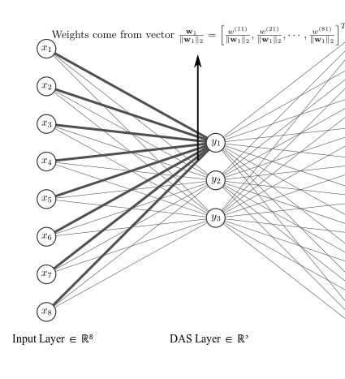

# Tutorial: Training using a data frame generated by EasyVVUQ

In this tutorial we will create a forward uncertainty-propagation surrogate using a Deep Active Subspace network, trained on a data frame generated by [EasyVVUQ](https://github.com/UCL-CCS/EasyVVUQ). Forward uncertainty propagation is defined as computing the output distribution of a computational model, given *assumed* probability density functions for the input paramaters of the model, see the image below for a sketch of the problem. A related problem is creating a cheap surrogate model for the input-output map, which can be evaluated at a fraction of the cost of the computational model. EasyVVUQ is VECMA's forward uncertainty propagation toolkit. 


## Problem definition

For computational efficiency we will consider the analytical Sobol G function, see [this page](https://www.sfu.ca/~ssurjano/gfunc.html) for a desription of this function. The following files are relevant:

* `tests/deep_active_subspaces/model/g_func.py`: the implementation of the Sobol G function.
* `tests/deep_active_subspaces/generate_easyvvuq_dataframe.py`: script that generates the training data using EasyVVUQ.
* `tests/deep_active_subspaces/train_DAS_surrogate.py`: script that trains a Deep Active Subspace (DAS) surrogate on the EasyVVUQ data frame.

## Active subspaces

The Active Subspace method, introduced in [1], is a class of methods for forward propagation of uncertainty in high-dimensional input spaces. It attempts to circumvent the curse of dimensionality by
dimension reduction of the input space. Specifically, it projects the input vector x (of size `D`) to a lower-dimensional subspace y of size `d` (`d < D`), via a tall-and-skinny matrix `W_1` of orthogonal basis vectors. The active subspace is thus given by


where the main idea is that the dimension reduction simplifies the task of obtaining an accurate surrogate model. If we denote this surrogate by `g(y)`, and the full code as `f(x)`, we thus want to find a model that satisfies


Because `y` is a linear transformation of the inputs `x`, it opens up the possibility of findings directions along which the model varies most. This is especially useful if a model varies significantly in a direction that is not aligned with the coordinate axes of `x`. In `classical' active subspaces [1], dimension reduction is achieved by rotating the coordinate system such that it is aligned with the directions of most variability, after which only the most dominant directions are retained. To find these directions, the following average gradient matrix is constructed:


Here, `p(x)` is the chosen probability density function (pdf) of the inputs `x`. Since `C` is a symmetric, positive semi-definite matrix, it has the following spectral decomposition


Hence the matrix `W_1`, used to project `x` to `y` are the first `d` eigenvectors of `C`, which in turn correspond to the `d` largest eigenvalues. These `d` eigenvectors form an orthonormal basis aligned with the directions of most variability. Note that `C` is averaged over `p(x)`, and that in practise, the integral in `C` is often approximated using a Monte Carlo approach.

The approach described here is intuitive, and has nice theoretical properties, such as computable error bounds. The downside however, is that the gradient of `f` must be available. This requires the availability of an adjoint solver, or one must approximate the gradients using for instance finite differences. This downside has prompted the development of other active subspace methods which do not require access to the gradient. Some of these methods involve Gaussian processes [2], whereas others use deep learning. We will focus on the latter.

## Deep Active Subspaces

In [3], an approach is described in which artificial neural networks (ANNs) are used for `g`, and where `W_1` is found using back propagation. The column vectors of `W_1` still form an orthogonal basis. The difference is that these column vectors are no longer the eigenvectors of the gradient matrix `C`, but instead are constructed using Gram-Schmidt orthogonalization. As such, `W_1` is parametrized by a matrix `Q` of the same dimension, where the non-orthonormal column vectors `q_i` (size D) are made orthonormal via:


That is, we start with $\wb_1 := \qb_1$, and for all subsequent vectors $\qb_i$ we subtract the projections of $\qb_i$ onto each vector $\wb_j$ which has previously been orthogonalized. This leaves us with a orthogonal basis:


Finally, to obtain an orthonormal basis, each column vector is divided by its length. such that our final weight matrix becomes


Note that the projection `y = W_1^Tx` also occurs in a layer of a neural network if the activation function is linear. Thus, we can interpret the matrix `W_1` as a weight matrix of the first hidden layer (with `d` neurons and linear activation), connected to an input layer through which `x` is passed. Each column vector `w_i` contains the all weights connecting the input layer to the i-th neuron of the first hidden layer, see Figure below. Since the first hidden layer has only `d` neurons, and its weight matrix is determined from a Gram-Schmidt procedure, we call the layer the Deep Active Subspace (DAS) layer.



## EasyVVUQ Latin Hypercube campaign

## Training on a EasyVVUQ data frame

The EasyVVUQ data frame can be read into EasySurrogate via:

```python
# Create an EasySurrogate campaign
surr_campaign = es.Campaign()

# This is the main point of this test: extract training data from EasyVVUQ data frame
features, samples = surr_campaign.load_easyvvuq_data(campaign, qoi_cols='f')
```

This will output:

```
Extracting features ['x1', 'x2', 'x3', 'x4', 'x5']
Extracting output data ['f'] 
```
indicating that it has read samples drawn 5 input variables, which will be used as features. The output data is in this case a single column of the CSV output file of the G function, named 'f'. If you which the read multiple columns, specify a list of names under the `qoi_cols` parameter of `load_easyvvuq_data`. Note that `features` is an array, wheres `samples` is a dictionary indexed by the `qoi_cols`. In this case, `samples['f']` will return an array with all outut values of the G function. From this point onward we can simply use this data as training data for any surrogate. Here, we will use it to train an ANN surrogate:

```python
# Create artificial neural network surrogate
surrogate = es.methods.ANN_Surrogate()

# Number of training iterations (number of mini batches)
N_ITER = 10000

# The latter fraction of the data to be kept apart for testing
TEST_FRAC = 0.3

# Train the ANN
surrogate.train(features, samples['f'], N_ITER,
                n_layers=4, n_neurons=50, test_frac=TEST_FRAC)

```

Note that here we reserved the latter 30 % of the data for testing the accuracy of the surrogate. We evaluate the training and test error via:

```python
# get some useful dimensions of the ANN surrogate
dims = surrogate.get_dimensions()

# evaluate the ANN surrogate on the training data
training_predictions = np.zeros([dims['n_train'], dims['n_out']])
for i in range(dims['n_train']):
    training_predictions[i] = surrogate.predict(features[i])

# print the relative training error
error_train = np.linalg.norm(training_predictions - samples['f'][0:dims['n_train']]) /\
    np.linalg.norm(samples['f'][0:dims['n_train']])
print("Relative error on training set = %.3f percent" % (error_train * 100))

# evaluate the ANN surrogate on the test data
test_predictions = np.zeros([dims['n_test'], dims['n_out']])
for count, i in enumerate(range(dims['n_train'], dims['n_samples'])):
    test_predictions[count] = surrogate.predict(features[i])

# print the relative test error
error_test = np.linalg.norm(test_predictions - samples['f'][dims['n_train']:]) /\
    np.linalg.norm(samples['f'][dims['n_train']:])
print("Relative error on test set = %.3f percent" % (error_test * 100))
```

Here `dims` is a dictionary containing the size of the training, testing and total data, as well as the number of in- and output neurons of the ANN. The output will look something like:

```
Relative error on training set = 0.294 percent
Relative error on test set = 2.944 percent
```
indicating that we have a training / test error of 0.3 % and 3 % respectively. Again, the entire script can be found here: `tests/easyvvuq_easysurrogate_coupling/coupling_example.py`.
