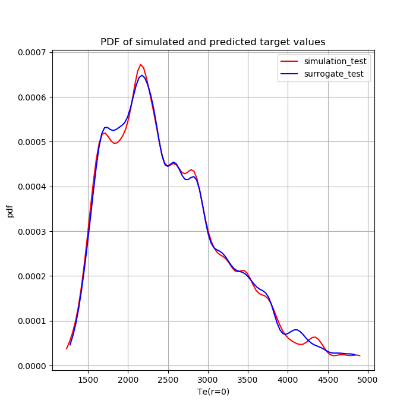

# Tutorial: Gaussian Process for Fusion transport tutorial example

In this test we use data describing profiles of tokamak plasma parameters defined by simulations converged
to a steady-state.

To learn more about the the model, refer to [the EasyVVUQ tutorial page](https://easyvvuq.readthedocs.io/en/dev/fusion_tutorial.html)

## Files

All the python script for the tutorial files are located at the `tests\fusion_tutorial` folder:

+ `tests\fusion_tutorial\save_data.py` : a script to run an ensemble of transport model solvers and save initial data
+ `tests\fusion_tutorial\load_data.py` : a script to prepare HDF5 files for surrogate, avoiding re-running numerical solutions
+ `tests\fusion_tutorial\train_gp_surrogate.py` : a script to train a GPR surrogate model
+ `tests\fusion_tutorial\gp_surrogate_predict.py` : a script to produce surrogate model predictions for test dataset
+ `tests\fusion_tutorial\gp_surrogate_analyse.py`  : post-processing of the surrogate predictions

Run the script files in order to go through the tutorial.

## Get training data 

First step to apply a surrogate is to generate training data with `tests\fusion_tutorial\load_data.py`.

In the first example we consider a surrogate trained on a one-shot design of numerical experiments.

In our case we run a set of transport model instances with parameter values design defined
by a random sampler of [EasyVVUQ package](https://github.com/UCL-CCS/EasyVVUQ) `easyvvuq.sampling.RandomSampler()`.
Distribution of each parameter is described in  `define_vary()` function.

The repository also provides `inputs.pickle` and `outputs.pickle` file with the results of corresponding simulations
as their solution take around 30 mins on a single-CPU system.
To run the solutions of the transport equation yourself, execute this part of `save_data.py`:

```python
    n_mc = 500

    data_frame, campaign, sampler = run_MC_case(n_mc = 500, local=True, dask=True, batch_size=7)
    
    features = save_features(campaign, sampler, n_mc)
    pd.DataFrame(features).to_pickle('inputs.pickle')

    samples = save_target(data_frame)
    pd.DataFrame(samples).to_pickle('outputs.pickle')
```

Running `python3 tests\fusion_tutorial\load_data.py` will prepare HDF5 files suitable for surrogates 
and further tutorial steps.

## Train the Gaussian Process Regression model

To train the model load the data from the numerical simulations 

Next, we create a GP_Surrogate object with following:

```python
    # create a surrogate object
    surrogate = es.methods.GP_Surrogate(n_in=ndim_in, n_out=ndim_out, backend='scikit-learn')
```

It requires to know about the dimensionality of the input and output data. We can also choose the backend 
implementation of the regression model which we want to use.

The features that we choose in this example are scalar, not considered to be located on spatial or temporal axis, and 
of different nature. Still, the approach of Gaussian Process Regression required defining metrics on input parameter 
space and features will be scaled to a unit standard deviation by surrogate implicitly.

The following will train the model:

```python
    # train surrogate model with given data
    surrogate.train(features, target, test_frac=test_frac, basekernel='Matern', noize='fit')
```

It is necessary to specify the training consisting of feature and target data. On this phase one can also choose
the fraction of dataset withheld for future testing with `test_frac`, which by default will be taken from 
the end of passed datasets.

The parameters of resulting model can be viewed with:

```python
    # print parameters of resulting surrogate
    surrogate.model.print_model_info()
```

The campaign together with its surrogate model can be saved via:

```python
    # save the app and the surrogate
    campaign.add_app(name='gp_campaign', surrogate=surrogate)
    campaign.save_state(file_path='gp_model.pickle')
```

## Prediction with GPR surrogate

In this tutorial, we use surrogate to predict new target values for saved feature test set.

## Analysis of the surrogate performance

We use test set to analyse the accuracy of the GPR model comparing target values from simulations and from 
surrogate predictions by calculating relative absolute errors, relative mean squared error, distributions of QoI
and distances between them.

### Accuracy of surrogate on testing set

In case when we have only information in the quasi-steady-state of the modeled system or do not have information
about any time evolution, we can estimate the accuracy of the surrogate as the estimator for the quantities of 
interest we trained it on.

In context of uncertainty quantification we will be interested in Probability Density Functions of QoI and its moments.
Considering the given exemplary physical model, we might chose a scalar value that is interesting to analyse as
the ), which is the temperature in the
core of the fusion reactor in the point where it is
potentially highest, but also most uncertain.

The PDF of the central temperature obtained by a Gaussian Process surrogate can be got via a
`Base_Analysis` object and it `get_pdfs()` method, and with `GP_Analysis` object adn its `plot_pdfs` method.

```python
    
    # load the campaign
    campaign = es.Campaign(load_state=True)

    # load the data
    data_frame_sim = campaign.load_hdf5_data()
    data_frame_sur = campaign.load_hdf5_data()

    # chose the QoI
    samples = data_frame_sim['Te']
    predictions = data_frame_sur['Te']
    
    # Get indices of training and testing samples
    train_inds = campaign.surrogate.feat_eng.train_indices.tolist()
    test_inds = campaign.surrogate.feat_eng.test_indices.tolist()

    # create GP analysis object
    analysis = es.analysis.GP_analysis(campaign.surrogate)

    te_ax_ts_dat_dom, te_ax_ts_dat_pdf = analysis.get_pdf(samples[test_inds][:, 0])
    te_ax_ts_surr_dom, te_ax_ts_surr_pdf = analysis.get_pdf(predictions[test_inds][:, 0])

    analysis.plot_pdfs(te_ax_ts_dat_dom, te_ax_ts_dat_pdf, te_ax_ts_surr_dom, te_ax_ts_surr_pdf,
                       names=['simulation_test', 'surrogate_test'],
                       qoi_names=['Te(r=0)'], filename='pdf_qoi_trts')

``` 

Plot of the statistics from simulations and from the surrogates are shown.



Full script of the test case, including analysis of surrogate errors and plots of surrogate predictions are in 
`tests\fusion_tutorial\fusion_tutorial.py` script.

### Sequential design.

One of the features that probabilistic surrogate models enables is a sequential design for numerical experiments.

It uses the posterior probability inferred by a model for a set of potential feature value candidates to define
the most suitable ones for which new simulation should be performed and added to training dataset.

To train the surrogate sequentially and generate new samples to be added to the training dataset one should run:

```python
surrogate.train_sequentially(n_iter=n, acquisition_function='f')
```

Where `n` is the number of new batches (typically just samples) to be added to the training dataset
and `'f'` is the name of criterion to choose the new points. 
These criterion should be implemented on a basis of surrogate type and should take an input sample and return
its criterion value.
Currently for Gaussian Process surrogates different acquisition functions include:
+ 'mu': maximum uncertainty
+ 'poi': probability of improvement 

To check the result of the sequential design procedure in case of two features you can use:

```python
analysis.plot_2d_design_history()
```
