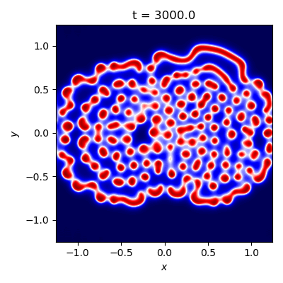
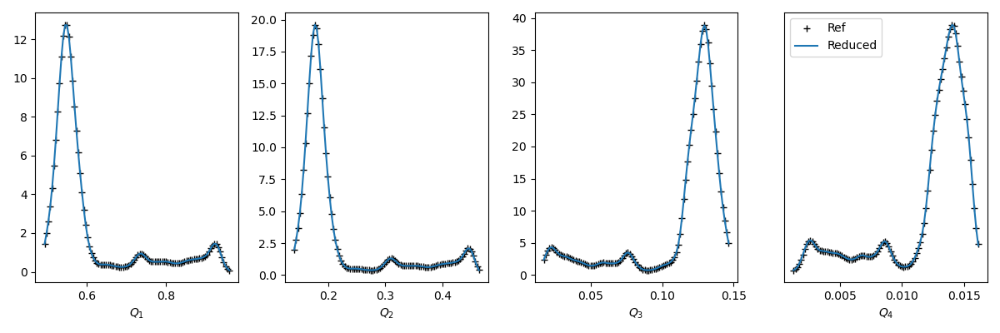

# Tutorial: Reduced Surrogates for the 2D Gray-Scott reaction-diffusion equations

The two-dimensional Gray-Scott reaction-diffusion equations model two chemical species `U` and `V`, which react according to `U + 2V --> 3V` and `V--> P`. The reactions are irreversible, so P is an inert product . The system is modelled by a set of partial differential equations for the local non-dimensional concentrations of `U` and `V`, denoted by `u(x, y, t)` and `v(x, y, t)`, both of which are in [0,1]. The **macroscopic** governing equations are


The overline above `u` and `v` denotes the fact that this is a macroscopic variable, defined in this tutorial as the part of `u` and `v` which can be resolved on a spatial grid of `128x128` points. The `G_u` and `G_v` are subgrid-scale terms, meant to take the effect of unresolved scale into account. 

Chemical `U` is added to the system at a feed rate given by the model constant `f`, and `V` is removed at a 'kill' rate `f+k`, where `k` is another model constant. The system is very sensitive to `f` and `k`, and a wide variety of spatiotemporal patterns are possible (Pearson, 1993), see the figure below for a snapshot of `u`.Conversion from `U` to `V` is governed by the nonlinear term `uv^2`, which is subtracted from the right-hand side of `u` and added to the right-hand side of `v`. Finally, two diffusion terms are present, configured such that `U` diffuses faster than `V`. We specify `D_u = 2*10^{-5}` and `D_v = 10^{-5}`, and use a `2.5 x 2.5` spatial domain with periodic boundary conditions. 



## Training data compression via reduced surrogates

Our aim here is to close the system by replacing the subgrid-scale terms `G_u` and `G_v` with data-driven surrogates. We generate a database of training data by solving the Gray-Scott equations for u and v at a higher spatial resolution of `1024 x 1024` nodes. Instead of creating a surrogate for the spatially dependent subgrid-scale terms, we will create so-called *reduced surrogates* using EasySurrogate. These are specifically geared towards predicting global (i.e. spatially integrated) quantities of interest of the form


Here, `q_i` is some function of the primitive variables and `A` is the area of the spatial domain. For instance, let us define our QoIs by the following set of integrands; `{q_1 = u, q_2 = u^2/2, q_3 = v, q_4 = v^2/2}`, i.e. we are interested in the average concentration of `U` and `V`, as well as the average squared concentrations. During the *training phase*, the task of the reduced subgrid-scale surrogates is to 'track' the reference QoIs, i.e.\ to keep `Q_i^{ref}(t) - Q_i(t)` small for all times during training, where `Q_i^{ref}` is the reference QoI computed from the high-resolution training data. We skip most details for the sake of brevity, and refer to [this paper](https://www.sciencedirect.com/science/article/pii/S0045793020300438?casa_token=opUTwCki7QIAAAAA:GwBFszrT7xF-yV5LDSUzcVZK45pA3cDSCj-tDoHgKGNS8YtpREVNXRFpsJapA84-sSIlob61ZZue) for more information. Allow us to just mention that the reduced surrogate consists of following expansion for `G_u` and `G_v`;


Here, `P_i^u` and `P_i^v` are the spatiotemporal modes of the expansions, which are expressed in terms of macroscopic variables only. They are computed by EasySurrogate at every time step using an orthogonalisation procedure. Furthermore, each mode is assigned to a particular quantity of interest (QoI). We will task `G_u` with tracking the QoIs with integrands `q_1=u` and `q_2=u^2/2`, and assign the remaining two to `G_v`, such that `d_u=d_v=2`. The key observation here is that only the `tau^u_i` and `tau_i^v` time series are unclosed, which are therefore the only components that must be learned from data. Compared to directly creating a surrogate for the full-field source terms `G_u` and `G_v`, the advantage of the reduced surrogates is thus a reduction in the degrees of freedom of the unclosed component, from `128^2` to 4 in this example. 

In this tutorial we will focus on the training phase only. That is, we will use EasySurrogate to train a reduced source term `G_u` and `G_v` such that the lower-resolution model tracks the 4 (spatially-integrated) quantities of interest of the higher-resolution model in time. This will result in 4 times series for the aforementioned `tau` terms, which in a next step could function as (reduced) training data for a surrogate method, e.g. a quantized softmax network, or a recurrent neural net.

## Limitations

The current beta version has only been tested on 2D problems, and is only suited for PDEs discretized by means of the spectral method. This will be generalized in future releases of the toolkit.

## Files

+ `tests/gray_scott_reduced/gray_scott_rk4.py`: the unmodified solver for the Gray Scott system, used to generate the training data. The discretization is achieved using the spectral method, and time stepping is done with the 4-th order Runge-Kutta scheme. Note the we have already pre-generated the necessary training data, which is is stored in `tests/gray_scott_reduced/samples/gray_scott_f0p02_k0p05_1024.hdf5`.

+ `tests/gray_scott_reduced/train_reduced_surrogate.py`: this is again the same Gray-Scott solver, except with reduced subgrid-scale terms. Execute this file to run the tutorial.

+ `tests/gray_scott_reduced/gray_scott_analysis.py`: a post-processing script, which computes some statistics.

## Training a reduced surrogate

The original Gray-Scott solver is modified in two main places. First, an EasySurrogate object is created as follows, and the training data from the high-resolution model is loaded:

```python

# create campaign
campaign = es.Campaign()

#load reference data of the statistics of interest
data_frame = campaign.load_hdf5_data(file_path = HOME + '/samples/gray_scott_ref.hdf5')
Q_ref = data_frame['Q_HF']

```
Next, we lower the spatial dimension from `256 x 256` to `128 x 128`

```
# lower the number of gridpoints in 1D compared to ref data
I = 7
N = 2**I
```

A reduced surrogate object is then created, and added to the Campaign

```
#number of stats to track per PDE  (we have 2 PDEs)
N_Q = 2

#create a reduced SGS surrogate object
surrogate = es.methods.Reduced_Surrogate(N_Q, N)

#add surrogate to campaign
campaign.add_app(name="gray_scott_reduced", surrogate=surrogate)

```

Here, `N_Q` is the number of QoIs that we wish to track per PDE. Remember that we'll let `G_u` track the spatial average of `u` and `u^2/2`, and `G_v` will track the average of `v` and `v^2/2`. Since both will track 2 PDEs we can create a single surrogate object.

Next, `G_u` and `G_v` must be included on the right-hand sides of both PDEs. The following modification to the original code occurs in the `rhs_hat` subroutine. At every time step, the reduced surrogate model is trained via

```python
#get the reference QoI data and the QoI computed by the model
Q_ref = kwargs['Q_ref']
Q_model = kwargs['Q_model']
    
#train the two reduced sgs source terms
reduced_dict_u = surrogate.train([V_hat_1, u_hat], Q_ref[0:N_Q], Q_model[0:N_Q])
reduced_dict_v = surrogate.train([V_hat_1, v_hat], Q_ref[N_Q:], Q_model[N_Q:])
```

Here, the `Q_ref` and `Q_model` contain the data and the computed values of the 4 QoIs. These are passed along to the `train` method of the reduced surrogate object, in addition to `[V_hat_1, u_hat]` and `[V_hat_1, v_hat]`. The latter define the QoIs we wish to track, and are defined as the partial derivatives of the integrands `q_i` with respect to the primitive variable, see the paper above for details. In this case we have


`V_hat_1` is the FFT (since it is a spectral code) of `np.ones([N, N])`. The `reduced_dict_u` and `reduced_dict_v` dictionaries contain, amongst others, the reduced subgrid-scale terms and the `\tau` time series. Now the right-hand sides can be modified

```python
#get the two reduced sgs terms from the dict
reduced_sgs_u = np.fft.ifft2(reduced_dict_u['sgs_hat'])
reduced_sgs_v = np.fft.ifft2(reduced_dict_v['sgs_hat'])

#compute right-hand sides of each PDE
u = np.fft.ifft2(u_hat)
v = np.fft.ifft2(v_hat)
f = -u * v * v + feed * (1 - u) - reduced_sgs_u
g = u * v * v - (feed + kill) * v - reduced_sgs_v
```

The script `tests/gray_scott_reduced/train_reduced_surrogate` will run for 10000 time steps, after which it will store data in the `samples` directory.

## Analysis

To perform the analysis, run `tests/gray_scott_reduced/gray_scott_analysis.py`. In this case we will just use the `BaseAnalysis` class to perform the post processing:

```
#create a campaign
campaign = es.Campaign()

#use a the base analysis here
analysis = es.analysis.BaseAnalysis()
```

The pdfs for all 4 QoI, computed from the trained reduced model and the training data are given below



Clearly, the reduced model and the refernce model are identical for our 4 QoIs during the trainig phase. This means that, as far as our 4 QoIs are concerned, the training data of the 4 `tau` times are sufficient, and we do not need to extract snapshots of the exact, `128 x 128` subgrid-scale terms from the data. 
