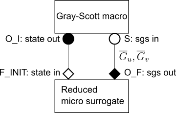

# Tutorial: coupling surrogates to the macro model via MUSCLE3

MUSCLE3 is the third version of the Multiscale Coupling Library and Environment. Its purpose is to couple models operating at different spatial and/or temporal scales in order to form a coupled multiscale simulation. The full documentation can found [here](https://muscle3.readthedocs.io/en/latest/index.html). We will use MUSCLE3 to couple a surrogate model to the macroscopic partial differential equations of the problem. In particular, we will illustrate the approach using the two-dimensional Gray-Scott reaction diffusion equations. These equations model two chemical species `U` and `V`, which react according to `U + 2V --> 3V` and `V--> P`. The reactions are irreversible, so P is an inert product . The system is modelled by a set of partial differential equations for the local non-dimensional concentrations of `U` and `V`, denoted by `u(x, y, t)` and `v(x, y, t)`, both of which are in [0,1]. The **macroscopic** governing equations are


The overline above `u` and `v` denotes the fact that this is a macroscopic variable, defined in this tutorial as the part of `u` and `v` which can be resolved on a spatial grid of `128x128` points. The `G_u` and `G_v` are subgrid-scale terms, meant to take the effect of spatially unresolved scales into account. 

In [this](https://github.com/wedeling/EasySurrogate/edit/master/tutorials/gray_scott/Gray_Scott.md) tutorial we created reduced surrogates for `G_u` and `G_v`, where we directly placed a call to the surrogate model inside the script of the macroscopic equations. We refer to the linked tutorial for more information on the reduced surrogates. Here, we will now place the reduced surrogate model in its own file, and use MUSCLE3 to perform the coupling.

## Files

+ `tests/gray_scott_reduced_muscle3/macro.py`: the macroscopic equations, modified with MUSCLE3 commands.
+ `tests/gray_scott_reduced_muscle3/micro.py`: the reduced surrogate.
+ `tests/gray_scott_reduced_muscle3/run.py`: the MUSCLE3 configuration file, which runs the simulation.

We will assume that MUSCLE3 has been properly installed.

## Modifications to the macroscopic model

The first modification to the macro model consists of placing the main script in its own subroutine, named `gray_scott_macro` here:

```python 
def gray_scott_macro():
    #######################
    # MUSCLE modification #
    #######################
    
    #define the MUSCLE in and out ports
    instance = Instance({
        Operator.O_I: ['state_out'],
        Operator.S: ['sgs_in']})
    
    while instance.reuse_instance():
        
        #Main script
```

Furthermore, the main script is also incapsulated in the `reuse_instance` loop. This reuse loop allows to run the model multiple times, for instance in an ensemble setting. The micro model is also executed multipled times (every time step), and will also be encapsulated in a reuse loop. See this [MUSCLE3 tutorial] for more information. 

In a MUSCLE3 setting, the macro model communicates with the micro model via so-called "ports". As can be seen above, we have defined two of them for the macro model. On the `O_I` port, the macro model sends its state to the micro model, and on the `S` port, it receices the reduced subgrid-scale (sgs) terms from the micro model, see also the figure below:



To send the macroscopic state to the micro model, the following code is inserted in `macro.py`:

```python
            #MUSCLE O_I port (state_out)
            t_cur = n*dt
            t_next = t_cur + dt
            if n == n_steps - 1:
                t_next = None
            
            #split state vars in real and imag part (temporary fix)
            V_hat_1_re = np.copy(V_hat_1.real)
            V_hat_1_im = np.copy(V_hat_1.imag)
            u_hat_re = np.copy(u_hat.real)
            u_hat_im = np.copy(u_hat.imag)
            v_hat_re = np.copy(v_hat.real)
            v_hat_im = np.copy(v_hat.imag)
                        
            #create a MUSCLE Message object, to be sent to the micro model
            cur_state = Message(t_cur, t_next, {'V_hat_1_re': V_hat_1_re, 
                                                'V_hat_1_im': V_hat_1_im, 
                                                'u_hat_re': u_hat_re,
                                                'u_hat_im': u_hat_im,                                                
                                                'v_hat_re': v_hat_re,
                                                'v_hat_im': v_hat_im,                                               
                                                'Q_ref': Q_ref, 'Q_model': Q_HF})
            #send the message to the micro model
            instance.send('state_out', cur_state)
```

Our state here consists of 3 matrices `V_hat_1`, `u_hat` and `v_hat`, containing Fourier coefficients. These are placed inside a `dict`, and sent to the micro model via a `Message` object. The micro model listens on the `state_in` port for these messages. The entire micro model is given by:

```python

def reduced_sgs():
    """
    An EasySurrogate Reduced micro model, executed in a separate file and linked to the
    macro model via MUSCLE3
    """
   
    instance = Instance({
        Operator.F_INIT: ['state_in'],     #a dict with state values  
        Operator.O_F: ['sgs_out']})         #a dict with subgrid-scale terms

    #get some parameters
    N_Q = instance.get_setting('N_Q')       #the number of QoI to track, per PDE
    N_LF = instance.get_setting('N_LF')     #the number of gridpoints in 1 dimension
    
    logger = logging.getLogger()
    logger.setLevel(logging.DEBUG)

    #Create an EasySurrogate RecucedSurrogate object
    surrogate = es.methods.Reduced_Surrogate(N_Q, N_LF)

    while instance.reuse_instance():

        #receive the state from the macro model
        msg = instance.receive('state_in')
        V_hat_1_re = msg.data['V_hat_1_re'].array.T
        V_hat_1_im = msg.data['V_hat_1_im'].array.T
        u_hat_re = msg.data['u_hat_re'].array.T
        u_hat_im = msg.data['u_hat_im'].array.T
        v_hat_re = msg.data['v_hat_re'].array.T
        v_hat_im = msg.data['v_hat_im'].array.T
        Q_ref = msg.data['Q_ref'].array.T
        Q_model = msg.data['Q_model'].array.T

        #recreate the Fourier coefficients (temporary fix)
        V_hat_1 = V_hat_1_re + 1.0j*V_hat_1_im
        u_hat = u_hat_re + 1.0j*u_hat_im
        v_hat = v_hat_re + 1.0j*v_hat_im

        # #time of the macro model
        t_cur = msg.timestamp
        
        # train the two reduced sgs source terms using the recieved reference data Q_ref
        reduced_dict_u = surrogate.train([V_hat_1, u_hat], Q_ref[0:N_Q], Q_model[0:N_Q])
        reduced_dict_v = surrogate.train([V_hat_1, v_hat], Q_ref[N_Q:], Q_model[N_Q:])

        # get the two reduced sgs terms from the dict
        reduced_sgs_u = np.fft.ifft2(reduced_dict_u['sgs_hat'])
        reduced_sgs_v = np.fft.ifft2(reduced_dict_v['sgs_hat'])

        #MUSCLE O_F port (sgs), send the subgrid-scale terms back to the macro model
        reduced_sgs_u_re = np.copy(reduced_sgs_u.real)
        reduced_sgs_u_im = np.copy(reduced_sgs_u.imag)
        reduced_sgs_v_re = np.copy(reduced_sgs_v.real)
        reduced_sgs_v_im = np.copy(reduced_sgs_v.imag)

        instance.send('sgs_out', Message(t_cur, None, 
                                     {'reduced_sgs_u_re': reduced_sgs_u_re, 
                                      'reduced_sgs_u_im': reduced_sgs_u_im,
                                      'reduced_sgs_v_re': reduced_sgs_v_re,
                                      'reduced_sgs_v_im': reduced_sgs_v_im}))
```

We can see that the micro model indeed receives the message of the macro model on the `state_in` port via `msg = instance.receive('state_in')`. This is done at every time step of the macro model, so this call is placed inside the reuse loop. Outside the reuse loop we i) define the ports of the micro model, ii) get some settings via `instance.get_setting` and iii) create the EasySurrogate ReducedSurrogate object.

As was the case in the [tutorial](https://github.com/wedeling/EasySurrogate/edit/master/tutorials/gray_scott/Gray_Scott.md) without MUSCLE3 coupling, the `surrogate.train` subroutine computes the reduced subgrid scale terms `G_u` and `G_v`. These are then sent back to the macro model on the `sgs_out` port. Back at the macro model, this Message is received via

```python
            #reveive a message from the micro model, i.e. the two reduced subgrid-scale terms
            msg = instance.receive('sgs_in')
            reduced_sgs_u_re = msg.data['reduced_sgs_u_re'].array
            reduced_sgs_u_im = msg.data['reduced_sgs_u_im'].array
            reduced_sgs_v_re = msg.data['reduced_sgs_v_re'].array
            reduced_sgs_v_im = msg.data['reduced_sgs_v_im'].array
```

Now the right-hand sides of both macroscopic PDEs can be computed.

## Putting it all together

The file `tests/gray_scott_reduced_muscle3/run.py` contains the MUSCLE3 configuration in which the two models are coupled. It is given by

```python
from libmuscle.runner import run_simulation
from ymmsl import ComputeElement, Conduit, Configuration, Model, Settings

#load the macro and micro model
from micro import reduced_sgs
from macro import gray_scott_macro

#Compute elements for the macro and micro model: specify the name of the python file here
elements = [ComputeElement('macro', 'macro', [1]),
            ComputeElement('micro', 'micro', [1])]

#connect the submodels
conduits = [Conduit('macro.state_out', 'micro.state_in'),
            Conduit('micro.sgs_out', 'macro.sgs_in')]

#create model instance
model = Model('gray_scott_reduced', elements, conduits)

#settings 
settings = Settings({'micro.t_max': 0.5, 'micro.dt': 0.5, 'N_Q': 2, 
                     'N_LF': 128, 
                     'macro[0].feed': 0.02, 
                     'macro[0].kill': 0.05,
                     })
#configure the model
configuration = Configuration(model, settings)

#actual subroutines to run, imported from macro.py and micro.py
implementations = {'macro': gray_scott_macro, 'micro': reduced_sgs}

#run the coupled model
run_simulation(configuration, implementations)
```
The different submodels are defined via `ComputeElement` objects, in which the name of the file containing the submodels must be specified. In the compute elements we can also specify the number of copies of the coupled system we'd like to have (`[1]` in this case). If we run this on an HPC node of for instance 28 cores, changing `[1]` to `[28]` allows us to use the entire node. This is useful in an ensemble setting, where we might want to run the same coupled simulation with different paramater values. Models are connected using `Conduit` objects, and `Settings` objects are used to pass parameters to the submodels. For instance the `f` and `k` values are retrieved in the macro model via 

```python
# gray scott parameters
feed = instance.get_setting('feed')
kill = instance.get_setting('kill')
```
In the case of an ensemble simulation, we can specify different parameter values to the different copies in the `Settings` object, e.g. by `macro[1].feed`, `macro[2].feed` etc.
